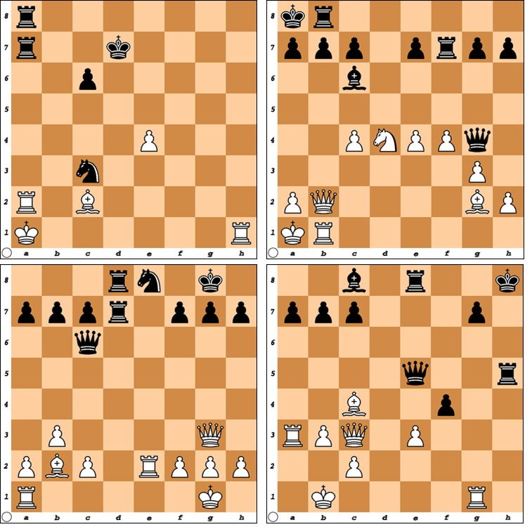

# Chess Pains: White To Move — April 2014

## Solution: HEADACHE

<https://www.janestreet.com/puzzles/chess-pains-white-to-move-index/>

The answer to this month's puzzle is an 8-letter English word.

## The puzzle solutions

We are given 4 chess puzzles to solve.  The solutions are from left to righ... Rh7, Nc6, Re8, Ra5.  Ra5 in the last puzzle is quite cool -- the queen is skewered to the defense of g7 so cannot take the rook because of Qg7#, and cannot take the queen because of Rh5#.  White wins the queen and the game.  

### Extraction

We have the letter RHNCRERA which are 8 letters.  We also have an implicit ordering of 5-6-7-8.  

OK the letters don't anagram -- they get rancher but not an 8 letter word.  Putting them in numberical order is RANCRHRE which also gets close to rancher.  I'll double check the solutions with a chess engine to make sure they are correct.

Soutions are correct.  

### Second try

OK, so what I needed was to consider where the piece was coming from as well.  That give Ra2 -> Rh7, Nd4 -> Nc6, Re2 -> Re8, and Ra3 -> Ra5.

Ignoring the pieces and ordering the moves, we get h1, e2, a3, d4, a5, c6, h7, e8, which spells headache!
