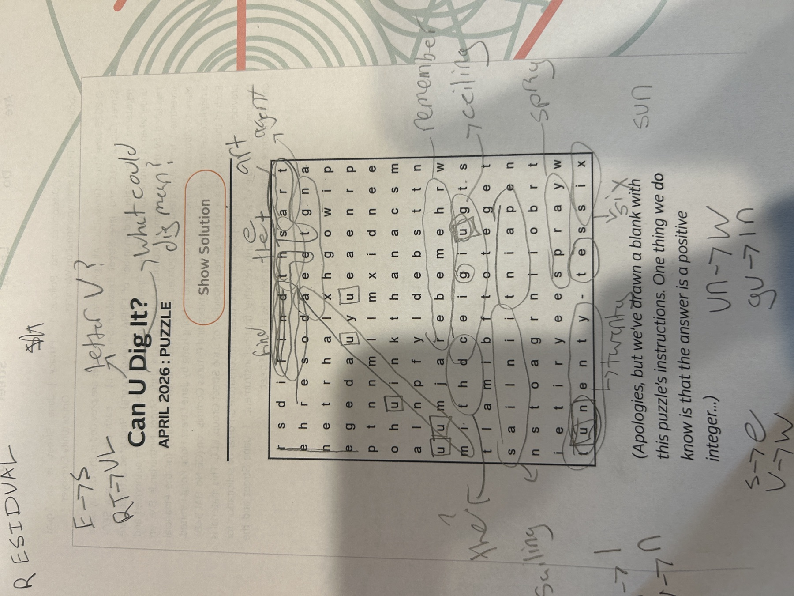
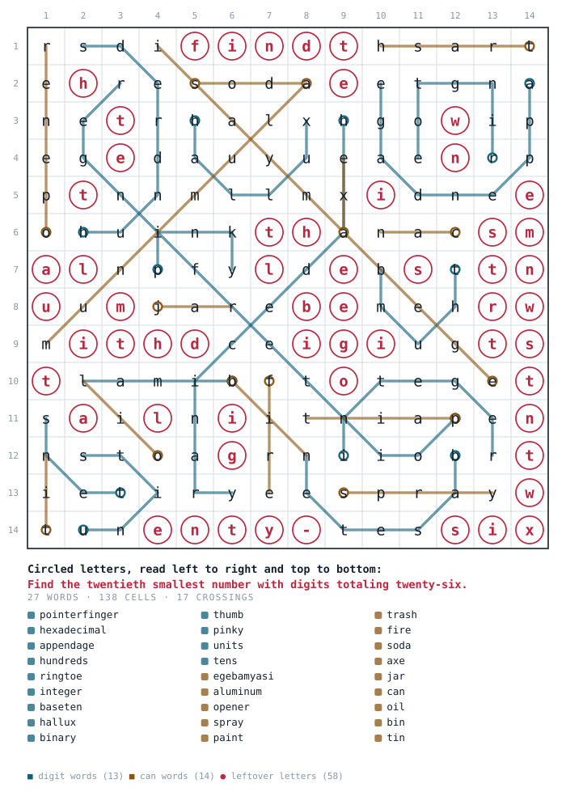
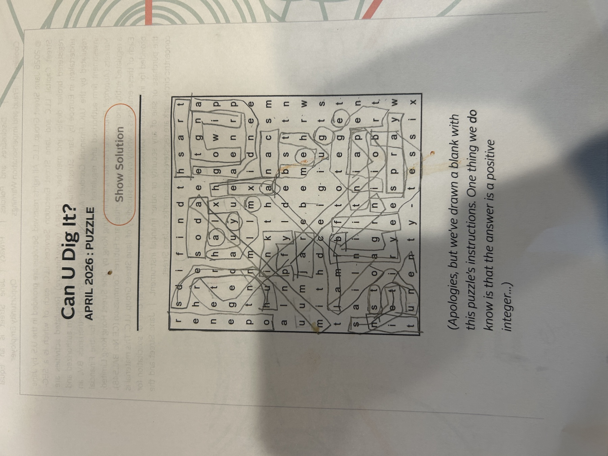

# Can U Dig It? — a Frustrating Exercise in Red Herrings

**Answer: $$3599$$**

Jane Street, April 2026 — [Can U Dig It?](https://www.janestreet.com/puzzles/can-u-dig-it-index/)

---

## AI use disclaimer

AI transcribed the grid from the image and laid out the skeleton of this file, and edited it for notation and to easily put in highlighted grids. I also used it to do an exhaustive search for words later in the solve, since I was really struggling to find all of them.

---

## Initial thoughts

This is a puzzle hunt style puzzle, some of my favorite but can be frustrating if you don't get the break-in. Based on the title and instructions line, the things that jump out to me are...

### The letter U instead of "you"

I'll be keeping an eye out for how the letter `u` is used in this puzzle, as the title directly references it.

### Dig

Makes me think that there might be some kind of topological wrinkle to this puzzle — letters moving up or down via "digging."

### Digit

"Dig it" is also just *digit* — numbers theme, and the solution is a digit (positive integer).

### Drawn a blank

Makes me think that the grid has been obfuscated by them "drawing blanks" all over it perhaps, or maybe this clue will be made more clear later.

---

## Stream of consciousness solve

Most of the solve was done on paper.

```

  1   r s d i f i n d t h s a r t
  2   e h r e s o d a e e t g n a
  3   n e t r h a l x h g o w i p
  4   e g e d a u y u e a e n r p
  5   p t n n m l l m x i d n e e
  6   o h u i n k t h a n a c s m
  7   a l n p f y l d e b s t t n
  8   u u m j a r e b e m e h r w
  9   m i t h d c e i g i u g t s
 10   t l a m i b f t o t e g e t
 11   s a i l n i i t n i a p e n
 12   n s t o a g r n i i o b r t
 13   i e t i r y e e s p r a y w
 14   t u n e n t y - t e s s i x
```

The grid reveals some interesting things to key in on. Most notably a hyphen at the bottom and seemingly the number twenty-six, but with obfuscation (the `w` → `un`, there is `tes` in front of `six`). If we take `w` and `tes` we can make the word *west*? Maybe something there, since west is a great puzzle word.  Twenty-six west reads like an instruction.

The top of the grid has the word *find*, and almost "find the" with the `e` → `s`. More "almost" words, and "find the" is certainly instructions I'd expect to find in a puzzle hunt clue.  The top and bottom of the grid providing the "break in" is typical for puzzles like this.

The top line says "find the art" or "find the," and I'm going to go with my initial hunch about the word scramble. It looks like we have letter substitution `e` → `s`, and leftovers. So if the clue is "find the art" the leftovers would be `rsdi` and the substitution letter would be `e`. Thus we have `rsdie`, which anagrams to *rides* or *red is*? Maybe. If the clue is just "find the" we have `rsdiart` as residuals, and adding the `e` we get an anagram of *trader is* (and some others) but nothing clean. Feels like there may be something here but not quite.

Lower down in the grid, row 9 seems to have an almost "the ceiling" with `e` → `d`, `l` → `g`, and `n` → `u`. The other letters are `mist`; adding `e`, `l`, and `n` gives us *listen* with an `m` missing, or *list men*.

I found the word **aluminum** as a diagonal word. That hits the `m`, making row 9 just *listen* after the substitution if we remove it. Maybe those are the "blanks" they were talking about?

OK, now I'm noticing that the top row is super close to being "find the residual" if you do some cleverness. That seems super likely, and the bottom would be "twenty-six west." We would need `RT` to be `UL` instead. Promising, maybe, that there is a `u` in the needed letters?

Aluminum → `Al`. I wonder if there are other elements in the grid. Nope, didn't find any. Is aluminum a red herring? Perhaps.

I think the "find the residuals" route is most promising, but other than the first and last lines, nothing is clearly jumping out. *Residuals* is missing a `u`, and "twenty-six west" replaces a `u`. I'm not using the replaced letters in any way, which is likely what I'm missing.

Worked on it for a while, getting nowhere.

Could also be "find the start", then carry into the next row with "and." The bottom row has an `e` and a `t` that literally could be "dug" up to the first row to fill in the `e` and the `t` needed for "find the start." There is literally an `e` and a `t` right below the `h` and the `s`, so you can "dig" down to make "find the start."

I am stuck again. "Twenty-six" and "find the start" haven't yielded anything concrete. The rules for how to construct each row may be complicated. The "find the start" just sitting there is really convincing that I'm onto something.

Here's my work so far on paper — not a lot of progress, mostly just staring.



I'm going to spend some time looking for digging-related words, since aluminum can be mined and holes have openings (*open* as a solution).

Words that may be promising: `aluminum`, `opener`, `spray`, `paint`, `trash`, `bend` (`u`s bend), `fire`.

OK, I think these aren't digging related — they are **CAN** related (*CAN* u dig it). Looking for can-related words now using a grid word search solving tool.

This seems very promising. I've got: `aluminum`, `opener`, `spray`, `paint`, `trash`, `soda`, `tin`, `axe` (body spray can), `jar`, `can` (literally, or *can-can* is a dance), `oil`, `bin` (as in, to can or to fire, or a literal can).

OK, I'm looking at the grid with the can words crossed off and not getting anywhere. The top is `sdifindt` — could be "find dist"? Like a distance measure, which could be an integer solution to the puzzle. Not convinced. The rest of the remaining letters are nonsense also.

Some `u`s are used in the can words, so I don't think they are "special" like I thought.

OK, so the *Can* in the title meant cans, so I like the idea of *Dig it* being *digit*. Looking for digits now.

I've found `six`, `ten` and `one`, which is not nearly good enough.

OK, I'm onto something. I have a bunch of digit words that snake through the grid — like `hundreds` and `binary`. They're connected, but not straight-line connected: they wiggle, and `hundreds` takes a diagonal (and has two different solutions).

OK, this is something, because I found **`hexadecimal`** — no way that's not intentional. I found `tens`, `nine`, `integer`, and `base ten`.

I think I've got it — the digits are in a "U" shape.

OK, I found some but the grid is still making no sense. `ifindt` is the first row. `hreetgna` is the second — no good anagrams or anything.

I handed off to AI with the prompt "look for U shaped digits in this grid, allow diagonal pathing."

OK, after much refinement of the search space, AI found some more — I missed that digits like *toes* and *fingers* work as well. I had to get very specific on pathing requirements (monotone turning and symmetry) to get the search space smaller.

Found `hexadecimal`, `hundreds`, `tens`, `binary`, `integer`, `pointer finger`, `units`, `base ten`, `thumb`, `pinky`, `hallux` (I didn't know this one before looking it up).  It was actually easier to have AI generate possible digit related words and then look for them or their roots manually.

OK, definitely onto something.  I'm just eliminating all the letters that are a part of the found words (a common puzzle hunt technique). The unused letters now read "I find the eatagwpey…" so I just need to keep finding words that work to eliminate more letters.

Found `appendage`. Now it's:

```
ifindthetaweyntmiethsmallesttnumberwithdigigtstoetalinstgiwunentysix
```

This is still not perfect, but very clearly we can extract "I find the twenty? smallest number with digits totaling? twenty six?" Going to see what word is left if I make it "I find the twentieth smallest number with digits totaling twenty-six"

OK, it's a diagonal — `aymabe` or `ebamya`? Moving forward it is "with digits totaling…"

OK, found `units`! And the other clue is `aymabege` or `egebamya`.

According to Google it's likely **`egebamyasi`**, which is in the grid, just two more letters up the diagonal! It's an album by the rock band **Can** — certainly correct. It removes the `I`, so it's just "Find the…", which is cleaner.

---

## The word lists

### Can words

Things that come in cans or are can-related.

`aluminum`, `opener`, `spray`, `paint`, `trash`, `soda`, `fire`, `tin`, `axe`, `jar`, `can`, `oil`, `bin`, `egebamyasi`

`egebamyasi` is the band Can's 1972 album.  I'm assuming we were meant to figure that out once the clue became clear.

### Digit words in U shapes

These are all about either number systems or fingers and toes.

`hundreds`, `hexadecimal`, `ringtoe`, `appendage`, `hallux`, `pointerfinger`, `integer`, `baseten`, `binary`, `thumb`, `pinky`, `units`, `tens`

---

## Final grid with found words

Every word traced, every leftover letter circled. Teal paths are digit words, tan paths are can words; the small ring marks where each word starts.



The tiling is exact and machine-checked: **27 words** covering **138 of 196 cells**, crossing at **17** cells, leaving **58** letters that read as the clue with no spares and nothing left over.

<details>
<summary>My marked-up paper grid</summary>



</details>

---

## The final clue

The leftover letters, read in normal reading order, are:

> **Find the twentieth smallest number with digits totaling twenty-six.**

---

## The answer

Solvable with a quick script — [`answerscript.py`](answerscript.py):

```python
def sum_digits(n):
    return sum(int(digit) for digit in str(n))


seen = 0
for i in range(10000):
    if sum_digits(i) == 26:
        seen += 1
        if seen == 20:
            print(i)
            break
```

The script yields **$$3599$$**, and it checks out: $$3 + 5 + 9 + 9 = 26$$.

---

## Final thoughts

I think this was a very tongue-in-cheek puzzle with some seemingly very intentional red herrings. The solution was completely literal (they added a blank to the instructions making digit dig it, the title just tells you what to look for (can and u shaped digit). Deceptively simpler than anticipated for a Jane Street puzzle once I had the solution, but getting to that point took hours longer than anticipated, which I think may have been the point? It was hard to write a tool (i.e. get AI to write a tool) to search the grid efficiently for the U shapes, and manually search was also hard and tedious. What worked best for me was actually just generating a list of digit-related words to look for and then searching for them manually. 

Final conclusion: I spent way too long on this puzzle.
