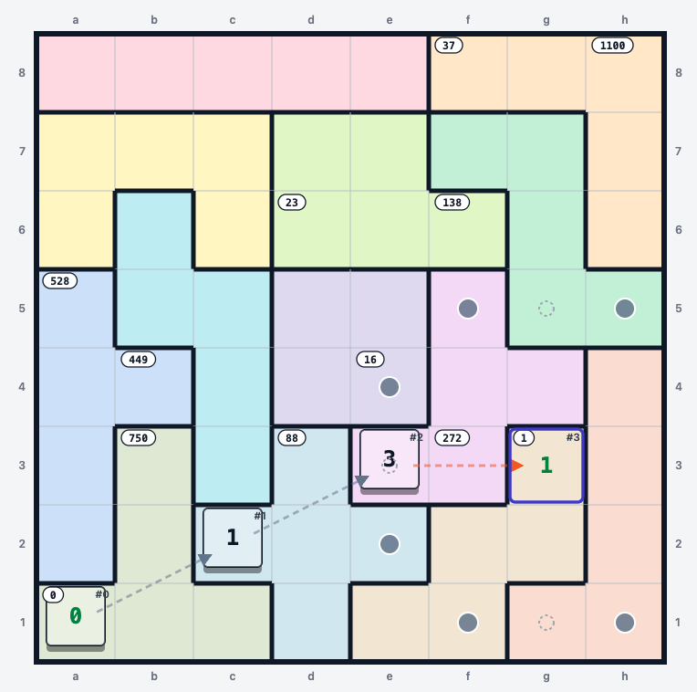
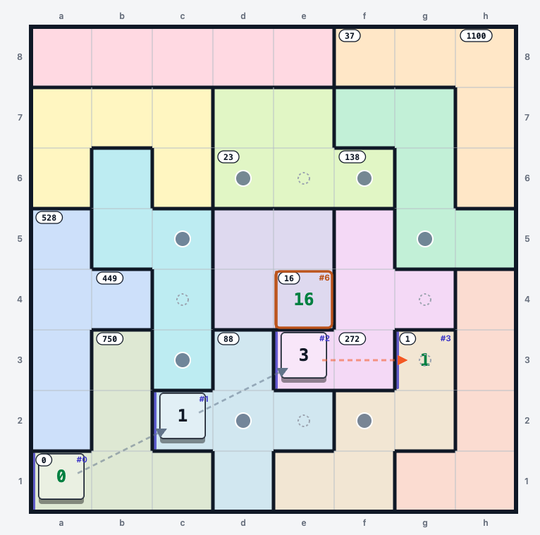
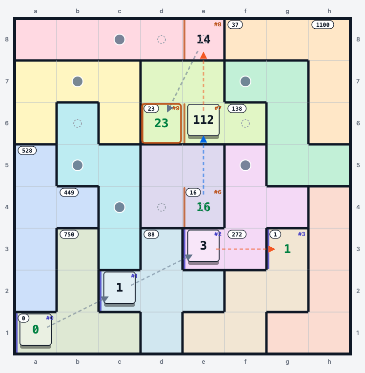
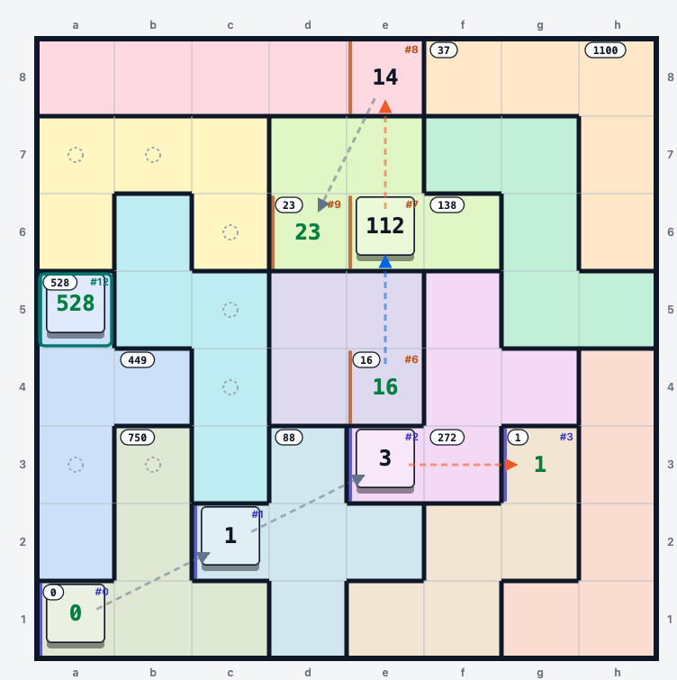
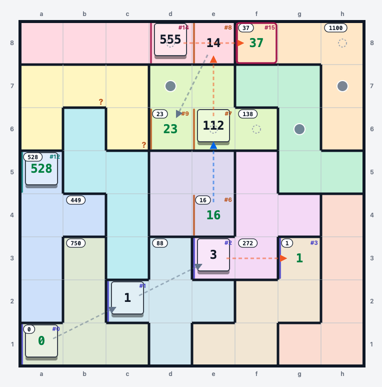
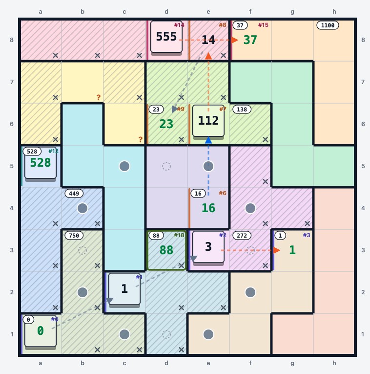
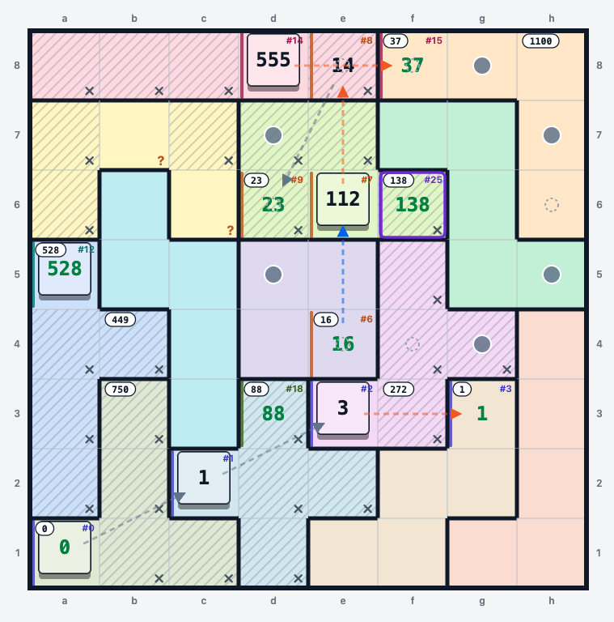
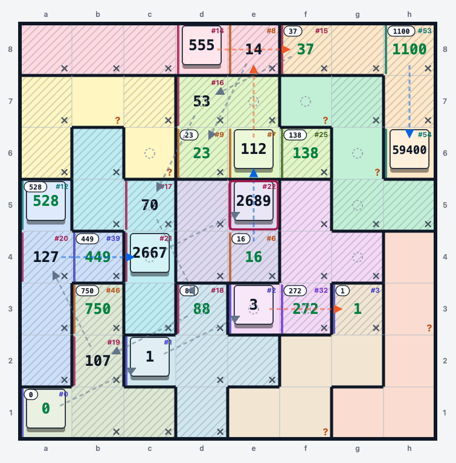

# Knight Moves 7 — solution

**Answer: 33609**

Jane Street, July 2026 — [‘Pent-Up’ Frustration 3 / Knight Moves 7](https://www.janestreet.com/puzzles/pent-up-frustration-3-knight-moves-7-index/).

---

## AI disclaimer + what I did

I solved this puzzle with AI assistance, specifically I had AI build a sandbox tool to use similar to sudokupad.  I then made logical deductions and tried to solve the entire puzzle by hand.  This proved quite doable (surprising), but I also had AI make me a tooling agent to help me enumerate the math pathways which made figuring out the series of jump ups, jump downs, and jump flats a lot easier once the 3 move rule was dispelled.  I'll try to walk through my logic starting from early assumptions.  I had AI help me write this too — using a recorded transcript of my muttering as I went.  I think AI could have easily one-shotted this puzzle to be honest, but it was very fun to step into the mind of the puzzle setter and try my hand at it.

---

## Notation

Every square on the board carries **three** attributes, and the walkthrough below refers to
each of them constantly, so it's worth fixing the shorthand up front.

| attribute | means | written as |
|---|---|---|
| **location** | where it is — file `a`–`h`, rank `1`–`8` | `f6` |
| **move number** | *when* the knight stands there | `#25` |
| **value** | the running score on arrival | `138` |

Written together, in that order:

> **`f6 #25 = 138`** — “the knight is on `f6` on move 25, holding a score of 138.”

Any attribute can be dropped when it isn't known yet, which happens constantly while solving:

- **`f6 = 138`** — a printed clue. The board tells us the value; the move number is still open.
- **`#25 = 138`** — the score chain has pinned the value of a move, but not its square.
- **`f6 #25`** — the square and its move are pinned, value implied.

Two more marks:

- **`▲`** after a location means that square is a **tower** (altitude 1). `c4▲ #21 = 2667`.
  No mark means ground (altitude 0).
- Moves are written by their effect: **`+21`**, **`×21`**, **`÷21`** for a level, up or down
  move made *on move 21*. The number in the operator is always the move number, which is what
  makes the arithmetic tick along.

Regions are named by their pentomino letter — **I V U P Z N Y F L T X W** — plus **O** for the
2×2 tetromino. `f7[Z]` means “`f7`, which lives in the Z pentomino.”

So a full leg of the path reads:

> `d3 #18 = 88` → `+19` → `b2 #19 = 107` → `+20` → `a4 #20 = 127` → `×21` → `c4▲ #21 = 2667`

---

## Key early deductions

**1. There are only three kinds of move**

A move's displacement `(dx, dy, dz)` is a signed permutation of `(0, 1, 2)`. The board is one
cube thick, so a square's standable altitude is 0 (ground) or 1 (tower) — which makes
`dz = ±2` impossible. Only two families of permutation therefore survive.

| move | shape | altitude | score on move N |
|---|---|---|---|
| **level** | ordinary knight move | both ends equal | `+N` → `score + N` |
| **up** | straight 2 orthogonally | ground → tower | `×N` → `score × N` |
| **down** | straight 2 orthogonally | tower → ground | `÷N` → `score ÷ N`, only if it divides |

Two consequences do most of the work later in determining which move is made when. A knight standing on a tower can only make an
ordinary knight move **to another tower**. And `×` and `÷` must alternate, with any run of `+`
between them — never two multiplies or two divides in a row.  This was later used to figure out the value of `K` as well as how to jump between marked candidates.

**2. A square shows a number *if and only if* the knight was on it at a recording moment.**

Recording moments are moves 0, 3, 6, …, 18, then every `K` moves. Twelve clue cells means
7 early records plus **5** late ones, so the path reaches move `18 + 5K`. It visits `M+1 ≤ 64`
distinct squares, so `M ≤ 63`, giving **`4 ≤ K ≤ 9`**. Equally useful in the other direction:
landing on a clue cell at a *non*-recording move is illegal, which kills candidate routes fast.

---

## Checkpoint 1: moves 1–3 are forced

I was quickly able to key in on the `g3 = 1` clue as impossible other than as a first move.  The start square and the next two are all towers since we need to jump down after adding 1 and 2, and since each region holds exactly one tower, there is only one way to place them:

> `a1▲ #0 = 0` → `+1` → `c2▲ #1 = 1` → `+2` → `e3▲ #2 = 3` → `÷3` → `g3 #3 = 1`

This is a very useful and restrictive start! Three towers placed — `a1[T]`, `c2[X]`, `e3[F]`.

> **[AI note — verified, optional addition]** I checked this exhaustively and it holds. Two
> small gaps you might want to spell out, since a reader will hit them:
> (a) score `1` is unreachable at `#6` or `#9`, which is what makes `g3` *have* to be `#3`;
> (b) there is a second arithmetic route to a clue value at `#3` — `÷1 ×2 ÷3` lands back on
> `0` — but `0` is only printed on `a1`, and revisiting is illegal, so it dies immediately.
> Worth one sentence, because it's the first place the no-revisit rule earns its keep.

## Checkpoint 2

Checkpoint 2 requires figuring out what we can do with 4, 5, and 6 to get to a candidate square.  Pretty quickly you can enumerate your options and realize that `16` is the only arrivable square, which requires 3 regular knight jumps.  We don't yet know how we get there, but move 6 lands us on `e4 #6 = 16`.

> `g3 #3 = 1` → `+4` → `+5` → `+6` → `e4 #6 = 16`

## Checkpoint 3

A similar process lets us realize checkpoint 3 must be `23`, by doing a `×7`, `÷8`, `+9` route with a tower being hit on move 7. The only legal routing for these steps is shown below.

> `e4 #6 = 16` → `×7` → `e6▲ #7 = 112` → `÷8` → `e8 #8 = 14` → `+9` → `d6 #9 = 23`

## Checkpoint 4

Again, enumeration is fairly easy with this restrictive 3 move rule, so we arrive at `528` as the only candidate landing spot for move 12, achievable by `+10`, `+11`, `×12`.  This places a tower at `a5`.  The pathing to `a5` is unknown.

> `d6 #9 = 23` → `+10` → `+11` → `×12` → `a5▲ #12 = 528`

## Checkpoint 5

A very useful and restrictive checkpoint.  We need to do `+13`, `+14`, `÷15` to reach `f8 #15 = 37`.  These 2 adds have to be done at level 1, so we get to place 2 more towers in the grid.  Additionally, the only way to reach `f8` is from `d8`, `f6`, and `h8` (a `÷` move travels 2 in a straight line, so those are its three straight-2 neighbours), and we can't reach `f6` or `h8` from `a5`.  We reach `d8` via `b7` or `c6`, so we know a tower exists at one of those two locations, which I've marked with a red `?`.

> `a5▲ #12 = 528` → `+13` → `(b7▲ or c6▲) #13 = 541` → `+14` → `d8▲ #14 = 555` → `÷15` → `f8 #15 = 37`

Both `b7` and `c6` are in region **U**, so whichever it is, U's tower is now spoken for.

## Checkpoint 6

We must reach `d3 #18 = 88` in 3 jumps, with simple addition each step.  There are a number of candidate paths, but importantly the first move must be `d7` or `g6`.  This will be important later, as we will rule out `g6` elegantly.  At this point, I also started greying out cells that could not contain towers.

> `f8 #15 = 37` → `+16` → `(d7 or g6) #16 = 53` → `+17` → `#17 = 70` → `+18` → `d3 #18 = 88`

> **[AI note — clarity]** `f8` has four knight-neighbours: `d7`, `h7`, `e6`, `g6`. You say the
> first move must be `d7` or `g6` but don't say why the other two die. `e6` is already used at
> `#7`; `h7` fails because from `h7` the only onward knight moves are `f6`, `g5` and `f8`, and
> none of those is a knight's move from `d3`. One line would close it.

## Checkpoint 7

Here is where the math gets a bit more sticky and harder to just try things out.  We no longer have the 3 move rule, but rather the `K` move rule, with `K` being something we need to find.  I played around for a while until finding a valid solution of `K = 7`, using `88 +19 +20 ×21 +22 +23 ÷24 +25 = 138`, which is at `f6`.  This took a while and while I was confident it was probably unique and correct, I wanted to make sure, so I had AI make a tool to do this search.  The condition that the path had to be between 4 and 9 steps in length and could only multiply or divide once in a row was restrictive, and the tool quickly found that this was the unique solution, so `K = 7`, and the future checkpoints fell out easily.

> `d3 #18 = 88` → `+19` → `#19 = 107` → `+20` → `#20 = 127` → `×21` → `▲ #21 = 2667`
> → `+22` → `▲ #22 = 2689` → `+23` → `▲ #23 = 2712` → `÷24` → `#24 = 113` → `+25` → `f6 #25 = 138`

Note the shape this forces: `×21` climbs onto a tower, `+22` and `+23` are level moves *at tower
altitude*, and `÷24` drops back down. **Moves 21, 22 and 23 are three towers in a row.**

## The remaining checkpoints

With `K = 7` the late checkpoints are fixed at moves 25, 32, 39, 46, 53.  Using our tool, the solutions are unique (though the pathing is still very open).

| leg | arithmetic | towers used |
|---|---|---|
| #19–#25 → `f6` = 138 | `88 +19 +20 = 127`, `×21 = 2667`, `+22 = 2689`, `+23 = 2712`, `÷24 = 113`, `+25 = 138` | **3** |
| #26–#32 → `f3` = 272 | `138 +26 +27 +28 +29 = 248`, `×30 = 7440`, `÷31 = 240`, `+32 = 272` | 1 |
| #33–#39 → `b4` = 449 | `272 ×33 = 8976`, `÷34 = 264`, `+35 … +38 = 410`, `+39 = 449` | 1 |
| #40–#46 → `b3` = 750 | pure addition: `449 + (40+…+46) = 449 + 301 = 750` | 0 |
| #47–#53 → `h8` = 1100 | pure addition: `750 + (47+…+53) = 750 + 350 = 1100` | 0 |

Note that 5 additional towers are used, leaving only one tower unused after arriving at `1100`. We must hit that tower at some point.  We've now hit all checkpoints and know the exact move order we hit them in.  All that's left (and it's the crux of the puzzle) is to determine a legal path order.

> **[AI note — asset]** `SS8.png` is used here *and* again under Crux 1. The image already
> shows `d7 #16 = 53`, `c5 #17 = 70` and `h6▲ #54 = 59400`, which are Crux 1 results — so it
> belongs at Crux 1, and this slot wants a screenshot taken *before* that deduction.

## Crux 1: f7 and g6 are heavily restricted

Two strong restrictions allow us to make progress from this point.  First is the pathing from `d3` to `f6`.  We need to jump into `f6` from level ground after jumping off a tower that is the third tower in a row.  This pathing that requires 3 towers ends up heavily restrictive.  The towers can either occur in the bottom two regions and the Z pentomino in the top right.  Or, they can occur in the center region, the N pentomino, and the Z pentomino in the top right.  In the Z pentomino, the towers can be on `f7`, `g6`, or `h5` due to the requirement of landing a knight's move from `f6` after the jump.  However, `h5` can be ruled out because there is no valid tower square it can be jumped to from.  So there is a tower on either `f7` or `g6` during the `d3` to `f6` pathing!

Those two cells are already very interesting — they are the only cells reachable from `h8`!  Since `h8` is reached via a normal ground level knight's jump, one of `f7` and `g6` must be used to reach `h8`.  Thus, both `g6` and `f7` are accounted for!!

Concretely:

- `h8 #53 = 1100` is arrived at via `+53`, a **level** move into a ground square. Its predecessor
  `#52` must be a ground knight-neighbour of `h8`, and there are exactly two: **`f7` and `g6`**.
- Moves 21 through 23 jump from tower to tower to tower.  There are only a few valid ways in the grid to do this: `c4▲ #21` → `e5▲ #22` → `f7▲/g6▲ #23`, or `g2▲ #21` → `h4▲ #22` → `f7▲/g6▲ #23`.  Note that both end on either `f7` or `g6`.
- So `#23` ∈ {`f7▲`, `g6▲`} — region **Z**'s tower — and `#52` ∈ {`f7`, `g6`} on the ground.
  They are different squares, so **the path consumes both**.

> **[AI note — the argument has a gap, though the conclusion is right]** I enumerated every
> legal `d3 #18` → `f6 #25` chain against the board at this stage: **16 of them survive
> geometry**, falling into three region-triples, not two. You list `N,O,Z` (`c4`→`e5`→`f7`/`g6`)
> and `L,W,Z` (`g2`→`h4`→`f7`/`g6`), but there is a third:
>
> - `d3 → e5 → f7 → h7▲[V] → g5▲[Z] → h3▲[L] → h5 → f6`
> - `d3 → f2 → h1 → h3▲[L] → g5▲[Z] → h7▲[V] → h5 → f6`
>
> In those, Z's tower is `g5`, and `#23` is `h3` or `h7` — *not* `f7` or `g6`. So "both end on
> either `f7` or `g6`" isn't established yet, and neither is "the path consumes both".
>
> The family is genuinely dead, so your conclusion stands — but by the `#54` argument, not this
> one: `#54` must be `×54` out of `h8`, whose only straight-2 neighbours are `f8` (used at `#15`)
> and `h6`. So `h6` must be a tower, so **V's tower is `h6`** — which forbids `h7▲`, killing
> both chains above.
>
> ⚠ **Careful about ordering.** As written, you derive `h6▲` *from* "`f7` and `g6` are both
> consumed", which is what you're trying to prove. If you use `h6▲` to kill the `V` family,
> that's circular. The fix is to establish `h6▲` first and independently — it only needs
> "one tower is still unplaced after `#53`, and `f8` is already used" — then use it to prune,
> then run your `f7`/`g6` argument. Your call whether to restructure or just add a line
> acknowledging the third family and pointing at `#54`.

**Key takeaway: no other part of the path can contain `f7` or `g6`.**

This has two major consequences.

First, the pathing from `f8 #15 = 37` to `d3 #18 = 88` on moves 16, 17 and 18 can no longer go through `g6`. It must therefore be:

> `f8 #15 = 37` → `+16` → `d7 #16 = 53` → `+17` → `c5 #17 = 70` → `+18` → `d3 #18 = 88`

Second, there is no longer a valid level knight's move *out* of `h8`.  Since we need to hit one more tower, we must jump to it immediately.  `f8` is already used at `#15`, so the only valid move is therefore to place a tower on `h6` and jump to it from `h8`, completing our route:

> `h8 #53 = 1100` → `×54` → `h6▲ #54 = 59400`

## Crux 2: which towers does the `d3` → `f6` path take?

To prove that `f7`/`g6` had a tower, we demonstrated that the `d3` → `f6` path must have towers at either `c4` and `e5` or at `g2` and `h4`.  We can determine that the `c4`/`e5` solution is correct by examining the `f3` → `b4` path.  Since that path immediately steps up onto a tower (`×33`), we must place a tower 2 cells away in a straight orthogonal direction from `f3`.  The candidates are `f5`, `f1` and `h3` — and `f5` is in region **F**, whose tower is already `e3`.  So the `#33` tower is `f1[W]` or `h3[L]`.  That removes `g2[W]` and `h4[L]` as valid pathing solutions for `d3` → `f6`, since they would consume both W and L and leave nothing for `#33`.  So the towers are at `c4` and `e5`.

> **[AI note — verified, worth one more line]** `c4`'s straight-2 neighbours are `c6`, `c2`,
> `a4`, `e4`. `c2` and `e4` are already used, which leaves `c6` and `a4` — so it's worth saying
> why `c6` dies: reaching `c6` at `#20` would need `#19` to be `e5`, but `e5` has to be the
> tower at `#22`. That leaves `a4`, and then `#19` must be `b2` (the only knight-neighbour of
> both `d3` and `a4` that isn't `c5`, which is taken at `#17`).

Moreover, the only valid location to jump up to `c4` from is `a4`, which determines the pathing from `d3` to `e5` completely:

> `d3 #18 = 88` → `+19` → `b2 #19 = 107` → `+20` → `a4 #20 = 127` → `×21` → `c4▲ #21 = 2667` → `+22` → `e5▲ #22 = 2689`

## Crux 3: how does `h8` work backwards to `b3`?

> **[AI note — unfinished]** This section is still an empty heading. From the transcript, this
> is the stretch you described as the second bifurcation: `#47`–`#53` is seven consecutive
> level moves (`750 + 47 + … + 53 = 1100`), so all eight squares from `b3 #46` to `h8 #53` are
> on the ground, and `#52` is `f7` or `g6`. Happy to draft it from the recording if you want.

## Endgame

The natural next place to look was which tower did the `f3 #32 = 272` jump up to.  The only two candidates are `f1` and `h3`.

> **[AI note — unfinished]** This stops mid-thought. For the record the resolution is `h3`,
> and the reason is a clean one worth writing up: **`e1` and `f1` are both in region W**, so at
> most one of them can be a tower. W's tower is needed for `#30` (`e1▲ #30 = 7440`), which
> leaves `h3▲[L]` as the only option for `#33` — then `÷34` gives `h5 #34 = 264`.
>
> I confirmed by search that forcing `#33 = f1` has no completion and `#33 = h3` does, but I
> have *not* reconstructed the by-hand argument that pins W's tower to `e1` rather than `f1` at
> this stage — `e1`'s up-approaches are `e3` (used at `#2`), `c1` and `g1`, so there's still a
> choice there. If you remember how you closed it, that's the missing line.

---

## The solution

### Towers

| region | square | visited at |
|---|---|---|
| T | `a1` | #0 |
| X | `c2` | #1 |
| F | `e3` | #2 |
| P | `e6` | #7 |
| Y | `a5` | #12 |
| U | `b7` | #13 |
| I | `d8` | #14 |
| N | `c4` | #21 |
| O | `e5` | #22 |
| Z | `f7` | #23 |
| W | `e1` | #30 |
| L | `h3` | #33 |
| V | `h6` | #54 |

### The path

| # | sq | op | score | | # | sq | op | score | | # | sq | op | score |
|--:|:--|:--|--:|-|--:|:--|:--|--:|-|--:|:--|:--|--:|
| 0 | `a1`▲ | — | **0** | | 19 | `b2` | `+19` | 107 | | 38 | `c6` | `+38` | 410 |
| 1 | `c2`▲ | `+1` | 1 | | 20 | `a4` | `+20` | 127 | | 39 | `b4` | `+39` | **449** |
| 2 | `e3`▲ | `+2` | 3 | | 21 | `c4`▲ | `×21` | 2667 | | 40 | `a6` | `+40` | 489 |
| 3 | `g3` | `÷3` | **1** | | 22 | `e5`▲ | `+22` | 2689 | | 41 | `c7` | `+41` | 530 |
| 4 | `h1` | `+4` | 5 | | 23 | `f7`▲ | `+23` | 2712 | | 42 | `b5` | `+42` | 572 |
| 5 | `f2` | `+5` | 10 | | 24 | `h7` | `÷24` | 113 | | 43 | `a3` | `+43` | 615 |
| 6 | `e4` | `+6` | **16** | | 25 | `f6` | `+25` | **138** | | 44 | `b1` | `+44` | 659 |
| 7 | `e6`▲ | `×7` | 112 | | 26 | `d5` | `+26` | 164 | | 45 | `d2` | `+45` | 704 |
| 8 | `e8` | `÷8` | 14 | | 27 | `c3` | `+27` | 191 | | 46 | `b3` | `+46` | **750** |
| 9 | `d6` | `+9` | **23** | | 28 | `a2` | `+28` | 219 | | 47 | `d4` | `+47` | 797 |
| 10 | `c8` | `+10` | 33 | | 29 | `c1` | `+29` | 248 | | 48 | `e2` | `+48` | 845 |
| 11 | `a7` | `+11` | 44 | | 30 | `e1`▲ | `×30` | 7440 | | 49 | `f4` | `+49` | 894 |
| 12 | `a5`▲ | `×12` | **528** | | 31 | `g1` | `÷31` | 240 | | 50 | `g2` | `+50` | 944 |
| 13 | `b7`▲ | `+13` | 541 | | 32 | `f3` | `+32` | **272** | | 51 | `h4` | `+51` | 995 |
| 14 | `d8`▲ | `+14` | 555 | | 33 | `h3`▲ | `×33` | 8976 | | 52 | `g6` | `+52` | 1047 |
| 15 | `f8` | `÷15` | **37** | | 34 | `h5` | `÷34` | 264 | | 53 | `h8` | `+53` | **1100** |
| 16 | `d7` | `+16` | 53 | | 35 | `g7` | `+35` | 299 | | 54 | `h6`▲ | `×54` | 59400 |
| 17 | `c5` | `+17` | 70 | | 36 | `f5` | `+36` | 335 | |  |  |  |  |
| 18 | `d3` | `+18` | **88** | | 37 | `e7` | `+37` | 372 | |  |  |  |  |

### Unvisited squares

| square | on-path neighbours | sum |
|---|---|--:|
| `a8` | `a7`=44 | 44 |
| `b8` | `b7`=541 + `c8`=33 | 574 |
| `g8` | `g7`=299 + `f8`=37 + `h8`=1100 | 1436 |
| `b6` | `b7`=541 + `b5`=572 + `a6`=489 + `c6`=410 | 2012 |
| `g5` | `g6`=1047 + `f5`=335 + `h5`=264 | 1646 |
| `g4` | `g3`=1 + `f4`=894 + `h4`=995 | 1890 |
| `h2` | `h3`=8976 + `h1`=5 + `g2`=944 | 9925 |
| `d1` | `d2`=704 + `c1`=248 + `e1`=7440 | 8392 |
| `f1` | `f2`=10 + `e1`=7440 + `g1`=240 | 7690 |
| | **total** | **33609** |

`▲` marks a tower. Bold scores are the twelve printed clues, at moves 0, 3, 6, 9, 12, 15, 18,
25, 32, 39, 46, 53.

## Answer extraction

For each unvisited square, sum the scores of its orthogonally adjacent squares that lie on the
path; add those nine sums.

## **Answer: 33609**

---

## Tools

Built along the way, all self-contained HTML in this directory:

- **[`knight-sandbox.html`](knight-sandbox.html)** — the board. Place and remove towers, mark
  squares `?` / `✗ no tower`, walk the knight with legal moves highlighted and the resulting
  score previewed on hover. Runs can start anywhere, float without a move number until one is
  known, be built forwards *or backwards* (inverting each operation), and join up when they
  meet — sharing out their numbering.
- **[`score-paths.html`](score-paths.html)** — pure score arithmetic, no board. Given a score,
  a move number and an altitude, enumerate what is reachable, connect two scores in a fixed
  number of moves, or chain clue values checkpoint to checkpoint. This is what found `K = 7`.
- **[`print-grids.html`](print-grids.html)** — blank grids, four to a page.

Neither tool solves anything: they answer *"is this legal, and what does it score"*, never
*"what should I play next"*. The deductions above — the forced opening, `K = 7`, the tower
placements, the `g6` elimination — were all made by hand. Once those pinned every score and
altitude, filling in the last 31 squares was a mechanical search with a unique answer.

## Verification

The final path was checked independently of the search that produced it: replaying from score
0, confirming every displacement really is a signed permutation of `(0,1,2)`, doing the
arithmetic in exact rationals to catch any non-integer division, confirming all 13 towers sit
one per region, that all 12 clue cells hit their printed values at the `K = 7` recording
moments and nowhere else, and that the path ends exactly when the last tower is reached.
No errors. The solution is unique given the deductions above.
