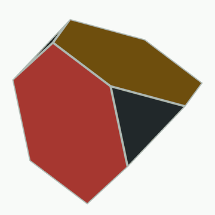
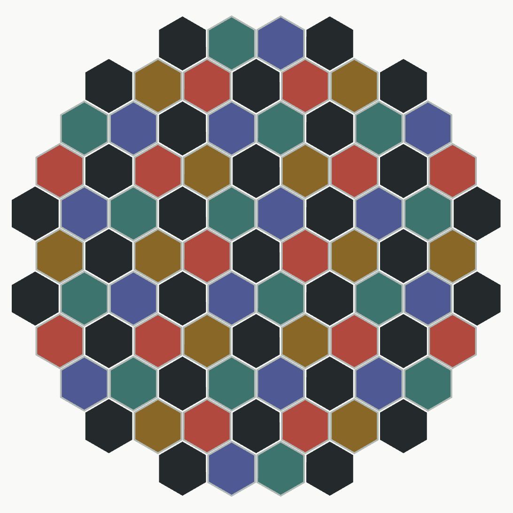
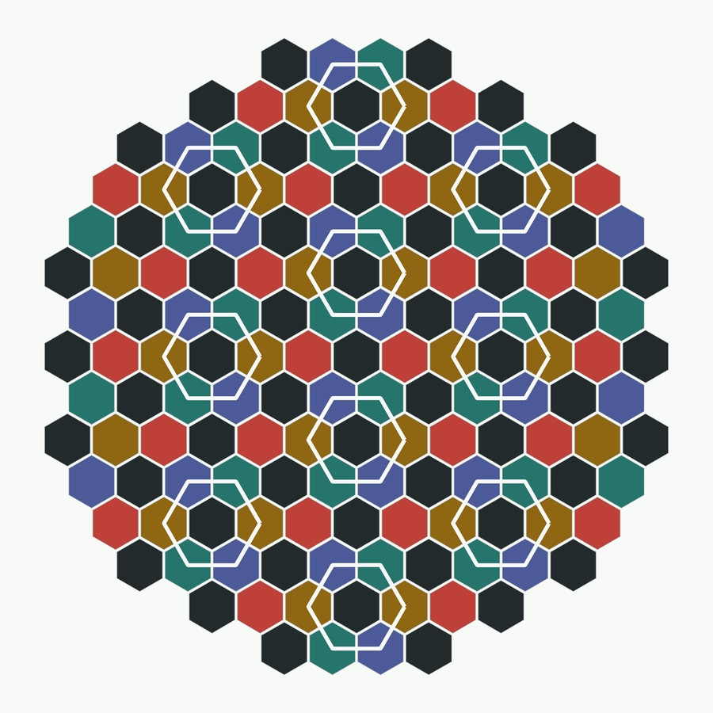
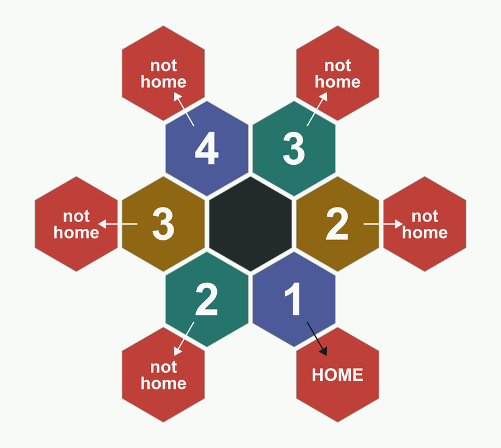

# Andy's Afternoon Amble — solution

**Answer: 11/20**

Jane Street, August 2026 — [Andy's Afternoon Amble](https://www.janestreet.com/puzzles/andys-afternoon-amble-index/).

---

## AI use disclaimer

I tried to solve this without AI use, but it helped me generate all the images in this report based on descriptions.  I also had it assist in editing this report so I didn't have to do as much manual markdown work.

---

## Idea 0: Restatement of important ideas in the rules.

1. Andy only steps on white hexagons, 1/3 to each of the three white neighbours.
2. Andy recognises exactly one tile — home, by its pheromones. Every other tile is anonymous.
3. Andy remembers the **sequence of turns**, not his position.  He can use this to deduce if he **should** be home.

He walks until he **should** be home. We want the probability that by then he has worked out
that the floor is not the truncated tetrahedron.

---

## Idea 1: Both worlds are the same visually to Andy, and 4-coloring them yields equivalent states to Andy

Andy never sets foot on black, so the only map that matters is the white-to-white adjacency.

- **The ball.** Four white hexagons, each adjacent to the other three, so each location has 3 options.
- **The floor.** Every white hexagon is ringed by six tiles that alternate white, black, white, black, white, black — so it touches exactly 3 white hexagons. It looks the same to Andy: he makes a move, then is left with 3 options.

### Color the ball.  

We can think of the four different hexagons in Andy's home world as 4 different colors.  Notice that if we choose Red, Blue, Green and Yellow, you can reach any of the other 3 colors from your color.  

### Color the kitchen floor
We can also color the kitchen floor with this same criteria -- four colors, each one allows you to reach the other 3 but not itself.  If we do this by preserving the rotational symmetry of each hexagonal set of 6 tiles, we are left with pathing that preserves all the characteristics of the ball, so Andy's remembered path on the ball lands on exactly the colour he is standing on.

Note, this means that the kitchen floor walk is exactly equivalent to walking around the sphere for Andy, and if you hit the same color, Andy will **think** he's returned to the same square.  The key to this question is that sometimes, Andy will **think** he's returned home, but will not smell his pheromones.

---

## Idea 2: Restate the question

From the puzzle: "Let $p$ be the probability that by the end of his afternoon amble on this new land he has discovered that he is no longer on the truncated tetrahedral sphere."  

Because of the way the question is worded, it's clear that this random walk on the kitchen floor is recurrent (he will eventually return home), and it is easy to prove. Watch Andy only on even steps. Two steps from a white tile take him back where he started with probability $\frac{1}{3}$, and otherwise to one of the six white tiles ringing it, $\frac{1}{9}$ each. Those six form a triangular lattice, so this is just a lazy 2-dimensional lattice walk, which is known to be recurrent. 

Since it's recurrent, we can reason about $p$ by reasoning about $1-p$.  Specifically, $1-p$ is the probability that the first square Andy **thinks** is home really is home — he finds his pheromones and is none the wiser.  Equivalently, $1-p$ is the probability that Andy leaves home, wanders around, and returns home before reaching any other square that colors as home. And therefore $p$ is the probability that he reaches a square he **thinks** is home but which is not marked as such.  If that happens, then by the end of his amble he knows he's on a different planet.  

So the new problem statement: What is the probability that in the course of his walk Andy lands on a tile he **thinks** is home, but isn't.

---

## Idea 3: Once he leaves home, he is locked in a loop

Let's assume Andy starts on Red. He **will not** know he's on the kitchen floor if he returns to his original red square.  He **will** know if he hits any other red square on his journey.  

Very nicely, notice how once he leaves his red square, he is locked into walking in a green/gold/blue/green/gold/blue circle until he hits a red.  If it's his original red tile, he is clueless, but if it's any of the other 5 reds, he will know!

---

## The Math

Because the statespace is so limited by our deductions, all that's left now is to calculate using recurrence relations.

Without loss of generality, let's imagine Andy starts on Red.  After one step, he is now locked into his loop, which he will walk around until he steps back onto a red square, ending the walk for our purposes.  If we index that loop based on how many steps away he is from his home square, we see that he starts 1 away, there are 2 squares that are 2 away, 2 squares 3 away, and 1 square 4 away.  

Let's say he "wins" if he steps back on his original square and loses if he steps on any other red square.  We define $p_i$ as the probability of winning from a square distance i away from the start.  Now, note that..

$$
\begin{aligned}
p_1 &= \tfrac{1}{3}\cdot 1 + \tfrac{1}{3}p_2 + \tfrac{1}{3}p_2 = \tfrac{1}{3} + \tfrac{2}{3}p_2 \\
p_2 &= \tfrac{1}{3}\cdot 0 + \tfrac{1}{3}p_1 + \tfrac{1}{3}p_3 = \tfrac{1}{3}p_1 + \tfrac{1}{3}p_3 \\
p_3 &= \tfrac{1}{3}\cdot 0 + \tfrac{1}{3}p_2 + \tfrac{1}{3}p_4 = \tfrac{1}{3}p_2 + \tfrac{1}{3}p_4 \\
p_4 &= \tfrac{1}{3}\cdot 0 + \tfrac{1}{3}p_3 + \tfrac{1}{3}p_3 = \tfrac{2}{3}p_3
\end{aligned}
$$

We have 4 equations and 4 variables, and substituting $p_4 = \frac{2}{3}p_3$ and working upwards gives us a solution of...

| distance from home | 1 | 2 | 3 | 4 |
|---|---|---|---|---|
| | $p_1$ | $p_2$ | $p_3$ | $p_4$ |
| probability of winning | $\frac{9}{20}$ | $\frac{7}{40}$ | $\frac{3}{40}$ | $\frac{1}{20}$ |

---

## The answer
Specifically, we note that $p_1$ is exactly the chance of him returning home without reaching another valid "home" square beforehand.  Thus the answer to the puzzle is $1 - p_1$, which is $\frac{11}{20}$.

